# Implementing Incremental Learning In Label Studio Using River ML Model

## Introduction
**River** is a Python library for online machine learning. It is the result of a merger between creme and scikit-multiflow River's ambition is to be the go-to library for doing machine learning on streaming data.

**Label Studio** is an open source data labeling tool for labeling and exploring multiple types of data. You can perform different types of labeling with many data formats.

## What we have done in this project?

- Use of label studio to annotate data using label studio ml backend.
- Using river python library to support incremental learning in label studio.
- Classification of text using naive_bayes MultinomialNB algorithm.

## To run this project follow these steps:

### Clone the github project
```python
git clone https://github.com/shivstha/incremental-learning-label-studio-using-river-model.git
```


*Note first make virtual environment to avoid packages conflict*
### Install the necessary packages
```python
pip install -r requirements.txt
```

### Run the label studio
```python
$ label-studio start
```

Go to **localhost:8080** in browser and create new task.

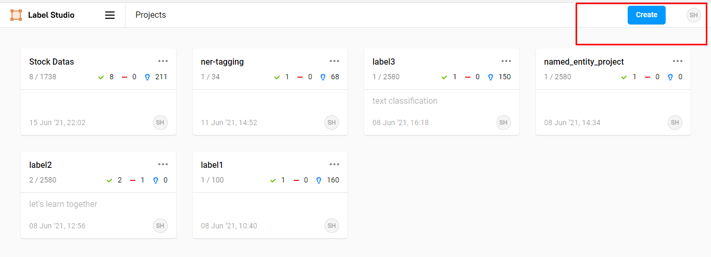


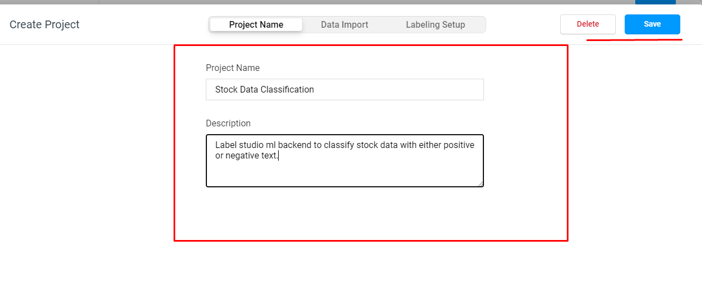

**Now import json file *stock_test_data.csv* in your working directory to newly created project**

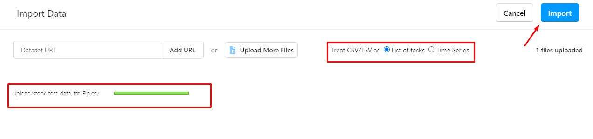

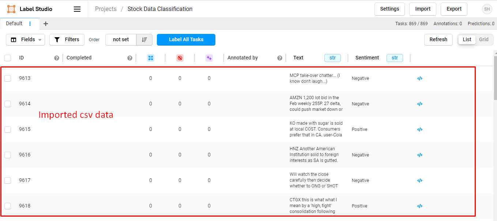

### Add labeling interface for your task 
Go to the Labeling Interface page and in the code section copy paste down below codes:
```python
<View>
  <Text name="text" value="$Text"/>
  <View style="box-shadow: 2px 2px 5px #999; padding: 20px; margin-top: 2em; border-radius: 5px;">
    <Header value="Choose text sentiment"/>
    <Choices name="sentiment" toName="text" choice="single" showInLine="true">
      <Choice value="Positive"/>
      <Choice value="Negative"/>
    </Choices>
  </View>
</View>
```
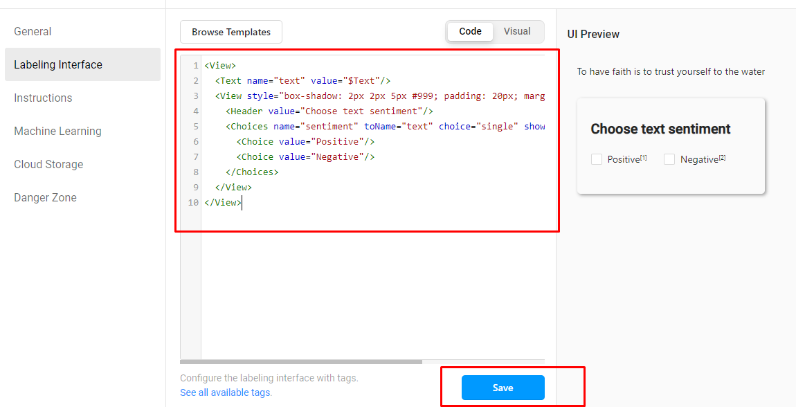


### Then run ML backend using docker to support multi-threaded operations(both prediction and training) using command as:
```python
$ cd my-river-new-model
$ docker-compose up --build
```

Go to **localhost:9090** in browser to check whether ml backend is working or not.
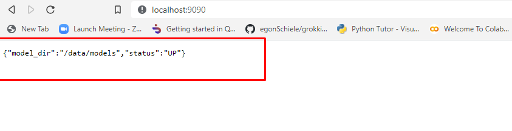


### Now lets connect our newly created project to ml backend as:

Go to the Machine Learning page(home/settings/Machine Learning) of the project and click on **Add Model** as:

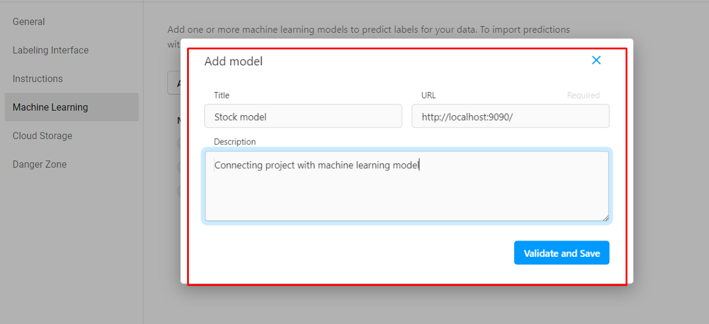

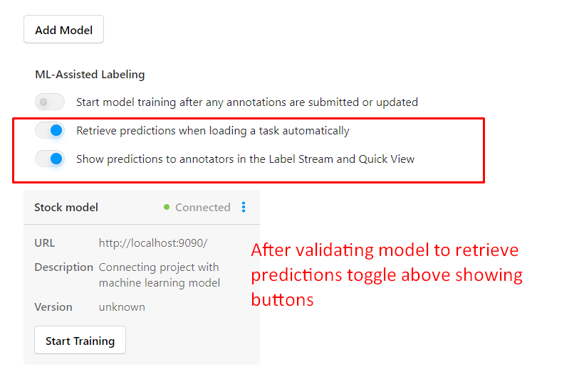


### After that go to task section and select fields like Prediction scores and results as:
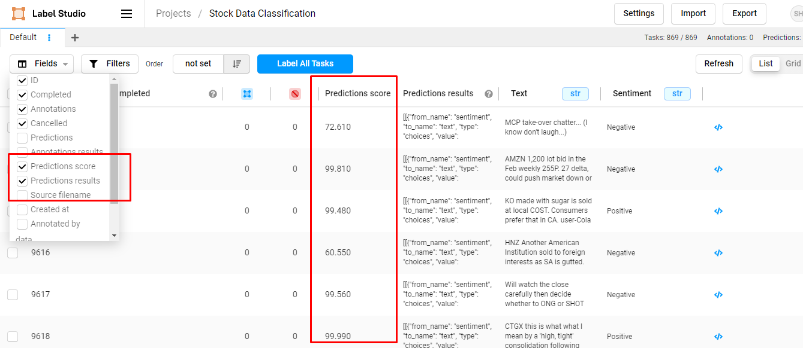


## For Incremental Learning 
To start train our pretrained model with newly annotated data done by manually, first we have to annotate couple of data as:

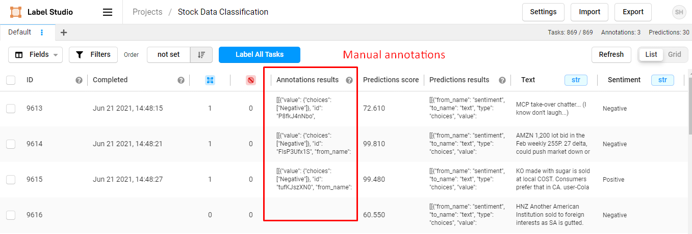


*Then go to the Machine Learning page and click on Start Training button as:

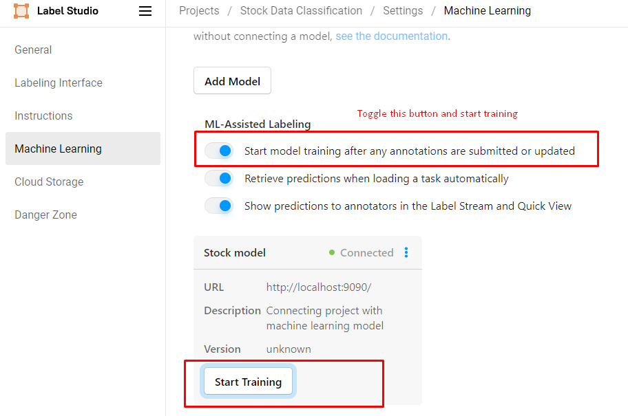


### Go to the logs sections rQ.log

In this log, we can check that our pretrained model is learning our new annotated data done by manually. 

As we annotate only 3 tasks, our model is trained by only 3 datas as:

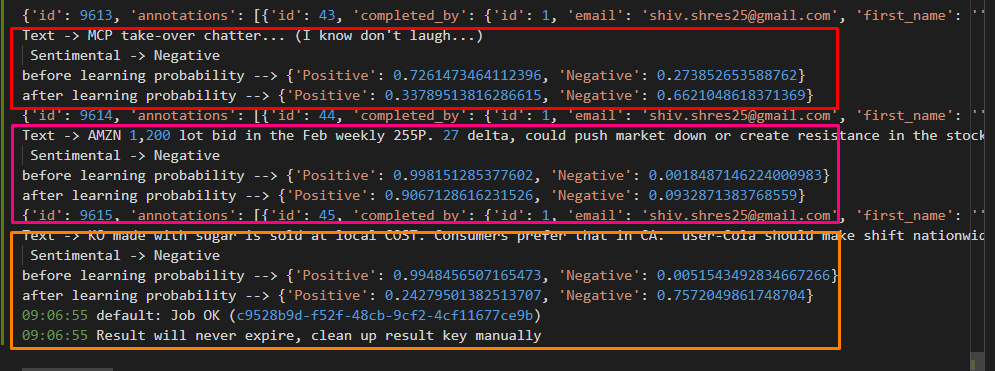